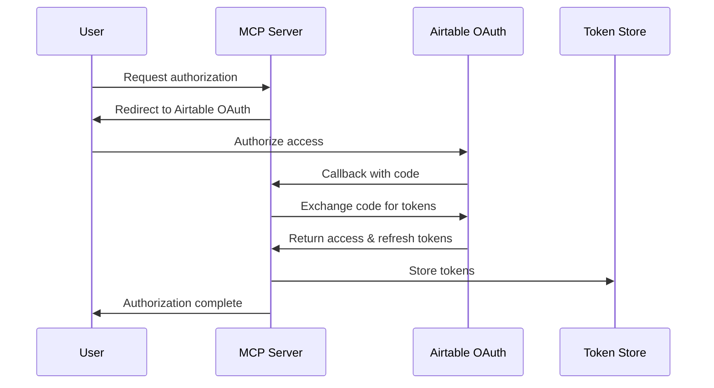

# OAuth Implementation Design for MCP Airtable Server

## Overview

This document outlines the design for adding OAuth 2.0 support to the MCP Airtable server, enabling users to authenticate with Airtable using OAuth instead of API keys (Personal Access Tokens).

## Architecture

### 1. Authentication Modes

The server will support two authentication modes:
- **API Key Mode** (existing): Using Personal Access Tokens
- **OAuth Mode** (new): Using OAuth 2.0 flow

### 2. OAuth Flow



### 3. Component Design

#### 3.1 OAuth Service (`src/services/oauth/`)

```typescript
// oauth-service.ts
export class OAuthService {
  constructor(
    private config: OAuthConfig,
    private tokenStore: TokenStore
  ) {}

  // Generate authorization URL
  getAuthorizationUrl(state: string): string

  // Exchange authorization code for tokens
  async exchangeCodeForTokens(code: string): Promise<TokenSet>

  // Refresh access token
  async refreshAccessToken(refreshToken: string): Promise<TokenSet>

  // Get valid access token (auto-refresh if needed)
  async getValidAccessToken(userId: string): Promise<string>
}
```

#### 3.2 Token Storage (`src/services/oauth/token-store.ts`)

```typescript
export interface TokenStore {
  // Store token set for a user
  async setTokens(userId: string, tokens: TokenSet): Promise<void>

  // Retrieve tokens for a user
  async getTokens(userId: string): Promise<TokenSet | null>

  // Delete tokens for a user
  async deleteTokens(userId: string): Promise<void>
}

// Redis implementation
export class RedisTokenStore implements TokenStore {
  // Implementation using Redis for scalable token storage
}

// In-memory implementation (for development)
export class InMemoryTokenStore implements TokenStore {
  // Simple Map-based storage for development
}
```

#### 3.3 OAuth Endpoints (`src/routes/oauth.ts`)

New endpoints for OAuth flow:
- `GET /oauth/authorize` - Initiate OAuth flow
- `GET /oauth/callback` - Handle OAuth callback
- `POST /oauth/refresh` - Refresh access token
- `DELETE /oauth/revoke` - Revoke tokens

#### 3.4 Enhanced Request Context

Update `src/utils/request-context.ts` to handle OAuth tokens:

```typescript
export interface RequestContext {
  // Existing
  airtableApiKey?: string;
  airtableBaseId?: string;
  
  // New OAuth fields
  authMode?: 'apikey' | 'oauth';
  oauthAccessToken?: string;
  userId?: string;
}
```

### 4. Configuration

#### 4.1 Environment Variables

```bash
# OAuth Configuration
AIRTABLE_OAUTH_CLIENT_ID=your_client_id
AIRTABLE_OAUTH_CLIENT_SECRET=your_client_secret
AIRTABLE_OAUTH_REDIRECT_URI=http://localhost:4000/oauth/callback
AIRTABLE_OAUTH_SCOPES=data.records:read data.records:write schema.bases:read

# Token Storage
TOKEN_STORE_TYPE=redis|memory
REDIS_URL=redis://localhost:6379

# OAuth Session
OAUTH_SESSION_SECRET=your_session_secret
```

#### 4.2 Configuration Schema Update

```typescript
// src/config/schema.ts
export const OAuthConfigSchema = z.object({
  clientId: z.string(),
  clientSecret: z.string().optional(),
  redirectUri: z.string().url(),
  scopes: z.string(),
  authorizationUrl: z.string().url().default('https://airtable.com/oauth2/v1/authorize'),
  tokenUrl: z.string().url().default('https://airtable.com/oauth2/v1/token'),
});
```

### 5. Client Modifications

#### 5.1 AirtableClient Enhancement

```typescript
// src/airtable/client.ts
export class AirtableClient {
  constructor(
    private auth: { type: 'apikey'; apiKey: string } | { type: 'oauth'; accessToken: string },
    private defaultBaseId?: string
  ) {
    // Initialize based on auth type
  }

  private getAuthHeaders(): Record<string, string> {
    if (this.auth.type === 'apikey') {
      return { Authorization: `Bearer ${this.auth.apiKey}` };
    } else {
      return { Authorization: `Bearer ${this.auth.accessToken}` };
    }
  }
}
```

### 6. Security Considerations

1. **State Parameter**: Use cryptographically secure random state parameter to prevent CSRF
2. **Token Encryption**: Encrypt tokens at rest in storage
3. **Secure Sessions**: Use secure session management for OAuth flow
4. **HTTPS Only**: Enforce HTTPS in production for OAuth callbacks
5. **Token Rotation**: Implement automatic token refresh before expiration
6. **Revocation**: Support token revocation and cleanup

### 7. Migration Strategy

1. **Phase 1**: Add OAuth support alongside existing API key auth
2. **Phase 2**: Update documentation and examples
3. **Phase 3**: Encourage migration to OAuth
4. **Phase 4**: Eventually deprecate API key support (following Airtable's timeline)

### 8. Implementation Steps

1. **Core OAuth Service**: Implement OAuth service with authorization flow
2. **Token Management**: Implement token storage and refresh logic
3. **HTTP Endpoints**: Add OAuth endpoints to HTTP server
4. **Client Updates**: Modify AirtableClient to support OAuth
5. **Handler Updates**: Update tool handlers to use OAuth tokens
6. **Testing**: Comprehensive testing of OAuth flow
7. **Documentation**: Update README and add OAuth guide

### 9. Error Handling

- Invalid/expired tokens: Automatic refresh attempt
- Refresh token expired: Require re-authorization
- Network errors: Retry with exponential backoff
- Invalid scopes: Clear error messages to user

### 10. Monitoring and Logging

- Log OAuth flow events (authorization, token exchange, refresh)
- Monitor token expiration and refresh rates
- Track OAuth vs API key usage metrics
- Alert on high failure rates

## Benefits

1. **Enhanced Security**: OAuth is more secure than static API keys
2. **Granular Permissions**: Scope-based access control
3. **User Control**: Users can revoke access anytime
4. **Future-Proof**: Aligns with Airtable's authentication direction
5. **Better UX**: No need to manually manage API keys

## Challenges

1. **Complexity**: OAuth adds significant complexity vs API keys
2. **State Management**: Need to manage user sessions and tokens
3. **Storage Requirements**: Need persistent storage for tokens
4. **Backward Compatibility**: Must maintain API key support
5. **Development Experience**: OAuth harder to test locally

## Next Steps

1. Review and approve this design
2. Set up OAuth integration in Airtable
3. Implement core OAuth service
4. Add token storage layer
5. Update HTTP server with OAuth endpoints
6. Modify client and handlers
7. Test end-to-end flow
8. Document OAuth setup and usage